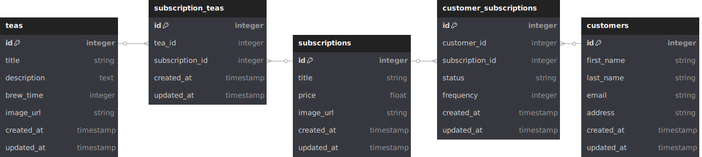

# Tea Subscription API

## Overview

Welcome to the backend repo for the Tea Subscription website! This repo holds the code responsible for running the database and exposing the API endpoints described in the [OpenAPI Documentation.](https://jarengarman.github.io/tea_subscription_api_docs/) Also be sure to check out the [frontend repo!](https://github.com/JarenGarman/tea_subscription_fe.git)

### Notable Technologies

- Ruby
- Rails
- Postgres (PostgreSQL)
- RSpec
- factory_bot
- simplecov

## Running Locally

### Requirements

- Ruby `3.2.2`
- bundler gem: `gem install bundler`
- [Postgres](https://www.postgresql.org/download/)

### Setup Steps

1. Clone the repo to your machine: `git clone https://github.com/JarenGarman/tea_subscription_api.git`
2. Open the directory: `cd tea_subscription_api`
3. Install required gems: `bundler install`
4. Setup the database: `bundle exec rails db:{create,migrate,seed}`

### Running Test Suite

- To run the entire suite: `bundle exec rake`
- To run only the model tests: `bundle exec rspec spec/models`
- To run only the request tests: `bundle exec rspec spec/requests`

## Database Design

## API Endpoints

To view the available endpoints for this API, please visit the [OpenAPI Documentation](https://jarengarman.github.io/tea_subscription_api_docs/). There you will find the endpoint definitions, required formatting for requests, example requests and responses (including JSON schemas), and the ability to try out requests on your local instance!

## Contributors

### Jaren Garman

- [LinkedIn](https://www.linkedin.com/in/jarengarman/)
- [GitHub](https://github.com/JarenGarman)
